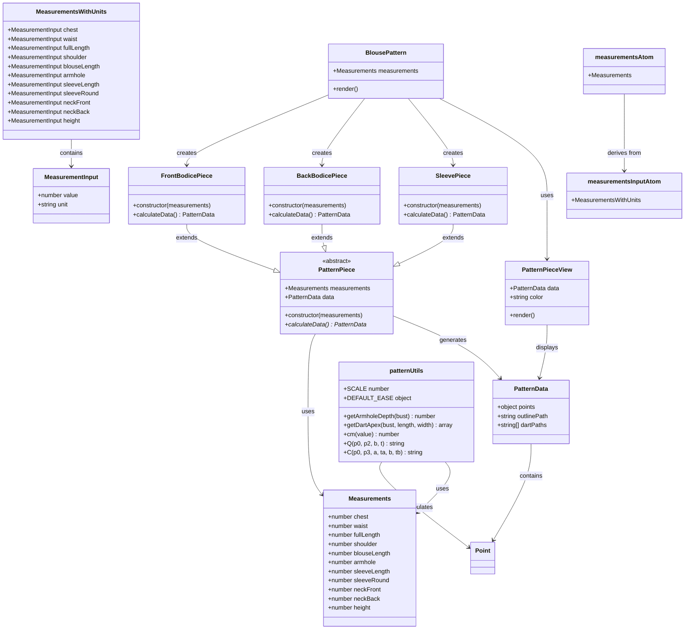

# Pattern Maker - Class Diagram

## Class Diagram

## Class Descriptions

### Core Data Types
- **Point**: Represents 2D coordinates (x, y)
- **Measurements**: Core body measurements in centimeters
- **MeasurementInput**: Input structure with value and unit (cm/in)
- **MeasurementsWithUnits**: Container for all input measurements
- **PatternData**: Output structure containing pattern points, paths, and darts

### Pattern Logic Classes
- **PatternPiece**: Abstract base class defining pattern calculation structure
- **FrontBodicePiece**: Calculates front bodice pattern
- **BackBodicePiece**: Calculates back bodice pattern  
- **SleevePiece**: Calculates sleeve pattern

### UI Components
- **PatternPieceView**: Renders individual pattern pieces
- **BlousePattern**: Main component that creates and displays all pattern pieces

### State Management
- **measurementsInputAtom**: Jotai atom for user input measurements with units
- **measurementsAtom**: Computed atom that converts input to centimeters

### Utilities
- **patternUtils**: Helper functions for pattern calculations and SVG path generation

## Key Design Patterns

1. **Template Method**: `PatternPiece` defines the structure, concrete classes implement specific calculations
2. **Strategy**: Different pattern pieces implement different calculation strategies
3. **Observer**: Jotai atoms provide reactive state management
4. **Factory**: `BlousePattern` creates different pattern piece instances